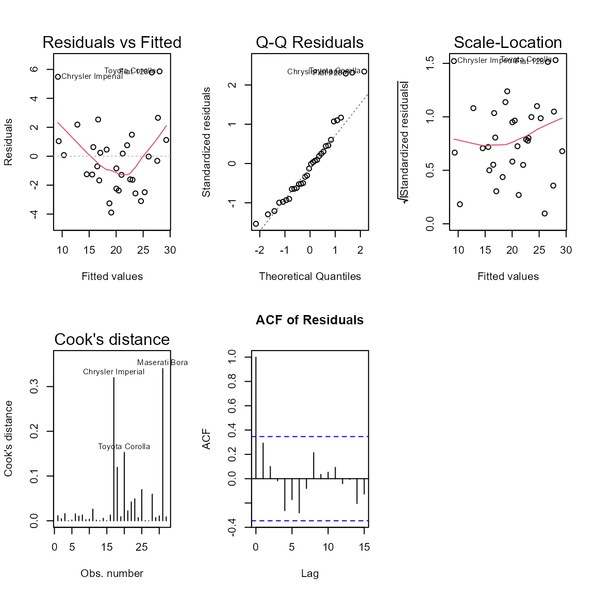

# Introduction to modeldiag

``` r

library(modeldiag)
```

## Overview

Statistical models rely on assumptions for valid inference. Violations
of these assumptions can lead to biased estimates, incorrect standard
errors, and misleading conclusions.

The `modeldiag` package provides a unified framework for diagnosing
these assumptions across multiple model classes, including:

- Linear models
- Logistic regression
- Count models (Poisson)
- Survival models (Cox proportional hazards)

This vignette introduces both the **statistical intuition** behind
common diagnostics and how to implement them using `modeldiag`.

------------------------------------------------------------------------

## Linear Models

Consider the classical linear regression model:

``` math
Y = X\beta + \varepsilon, \quad \varepsilon \sim N(0, \sigma^2 I)
```

Valid inference depends on several assumptions about the error term
$`\varepsilon`$.

### Multicollinearity

Multicollinearity occurs when predictors are highly correlated. This
inflates the variance of coefficient estimates.

The Variance Inflation Factor (VIF) is defined as:

``` math
\text{VIF}_j = \frac{1}{1 - R_j^2}
```

where $`R_j^2`$ is obtained by regressing predictor $`X_j`$ on all other
predictors.

Large VIF values indicate unstable estimates.

### Heteroscedasticity

Heteroscedasticity occurs when:

``` math
\text{Var}(\varepsilon_i) \neq \sigma^2
```

The Breusch–Pagan test evaluates whether residual variance depends on
predictors.

### Autocorrelation

Autocorrelation arises when:

``` math
\text{Cov}(\varepsilon_i, \varepsilon_j) \neq 0
```

The Durbin–Watson statistic tests for first-order autocorrelation.

### Normality of Errors

Many inferential procedures assume:

``` math
\varepsilon \sim N(0, \sigma^2)
```

The Shapiro–Wilk test evaluates this assumption.

### Influential Observations

Influential points disproportionately affect model estimates. Cook’s
distance measures this influence:

``` math
D_i = \frac{( \hat{\beta} - \hat{\beta}*{(i)} )^T X^T X (\hat{\beta} - \hat{\beta}*{(i)})}{p \hat{\sigma}^2}
```

------------------------------------------------------------------------

### Example

``` r

model_lm <- lm(mpg ~ wt + hp + disp, data = mtcars)
diag_lm <- diagnose_model(model_lm)
summary(diag_lm)
#> Model Diagnostics Summary
#> =========================
#> 
#> ---- multicollinearity ----
#> $success
#> [1] TRUE
#> 
#> $vif
#>       wt       hp     disp 
#> 4.844618 2.736633 7.324517 
#> 
#> 
#> ---- heteroskedasticity ----
#> p-value: 0.8143398 
#> Residual variance appears approximately constant. 
#> 
#> ---- autocorrelation ----
#> p-value: 0.01611772 
#> Residuals appear autocorrelated; consider time-series adjustments. 
#> 
#> ---- normality ----
#> p-value: 0.03304597 
#> Residuals deviate from normality; check model assumptions. 
#> 
#> ---- outliers ----
#> Number of influential points: 3 
#> Influential observations: Chrysler Imperial, Toyota Corolla, Maserati Bora 
#> Cook's distances for influential observations:
#> Chrysler Imperial    Toyota Corolla     Maserati Bora 
#>         0.3199707         0.1529771         0.3402911 
#> 3 influential observation(s) detected. Influential observations have Cook's distance above 4/n. Review these cases for leverage, data entry issues, or model fit problems.
```

------------------------------------------------------------------------

## Logistic Regression

Logistic regression models the probability:

``` math
\text{logit}(P(Y=1)) = X\beta
```

### Key Diagnostics

#### Linearity of the Logit

The model assumes a linear relationship between predictors and the
log-odds:

``` math
\log\left(\frac{p}{1-p}\right)
```

The Box–Tidwell test evaluates this assumption.

#### Goodness of Fit

The Hosmer–Lemeshow test compares observed and expected counts across
groups.

#### Separation

Complete or quasi-complete separation occurs when predictors perfectly
classify outcomes, leading to unstable or infinite estimates.

------------------------------------------------------------------------

### Example

``` r

model_glm <- glm(am ~ wt + hp, data = mtcars, family = binomial)
diag_glm <- diagnose_model(model_glm)
summary(diag_glm)
#> Model Diagnostics Summary
#> =========================
#> 
#> ---- multicollinearity ----
#> $success
#> [1] TRUE
#> 
#> $vif
#>       wt       hp 
#> 2.444297 2.444297 
#> 
#> 
#> ---- linearity_logit ----
#>    MLE of lambda Score Statistic (t) Pr(>|t|)  
#> wt     -0.088743              2.2318  0.03412 *
#> hp      3.205811              0.8980  0.37711  
#> ---
#> Signif. codes:  0 '***' 0.001 '**' 0.01 '*' 0.05 '.' 0.1 ' ' 1
#> 
#> iterations =  13 
#> 
#> Score test for null hypothesis that all lambdas = 1:
#> F = 3.6654, df = 2 and 27, Pr(>F) = 0.03905
#> 
#> 
#> ---- goodness_of_fit ----
#> p-value: 0.6716511 
#> Model fit appears adequate. 
#> 
#> ---- influential_observations ----
#> Number of influential points: 2 
#> Influential observations: Mazda RX4 Wag, Toyota Corona 
#> Cook's distances for influential observations:
#> Mazda RX4 Wag Toyota Corona 
#>     0.2034041     0.7917908 
#> 2 influential observation(s) detected. Influential observations have Cook's distance above 4/n. Review these cases for leverage, data entry issues, or model fit problems. 
#> 
#> ---- separation_issues ----
#> No separation issues detected.
```

------------------------------------------------------------------------

## Poisson Regression

Poisson regression assumes:

``` math
Y \sim \text{Poisson}(\lambda), \quad \log(\lambda) = X\beta
```

### Overdispersion

A key assumption is:

``` math
\text{Var}(Y) = \mathbb{E}(Y)
```

Overdispersion occurs when:

``` math
\text{Var}(Y) > \mathbb{E}(Y)
```

This leads to underestimated standard errors.

### Zero Inflation

Excess zeros beyond what the Poisson model predicts may indicate a
zero-inflated process.

------------------------------------------------------------------------

### Example

``` r

model_pois <- glm(carb ~ wt + hp, data = mtcars, family = poisson)
diag_pois <- diagnose_model(model_pois)
summary(diag_pois)
#> Model Diagnostics Summary
#> =========================
#> 
#> ---- multicollinearity ----
#> $success
#> [1] TRUE
#> 
#> $vif
#>       wt       hp 
#> 1.401553 1.401553 
#> 
#> 
#> ---- overdispersion ----
#> Residual deviance: 12.27804 
#> Degrees of freedom: 29 
#> Ratio: 0.4233806 
#> No evidence of overdispersion.
#> 
#> ---- zero_inflation ----
#> Observed zeros: 0 ( 0 %)
#> Expected zeros: 3 ( 9.3 %)
#> No evidence of zero-inflation.
#> 
#> ---- influential_observations ----
#> Number of influential points: 0 
#> No observations exceed the influence threshold.
#> No influential observations detected. Influential observations have Cook's distance above 4/n. Review these cases for leverage, data entry issues, or model fit problems. 
#> 
#> ---- residual_analysis ----
#> Mean residual: -0.04200633 
#> SD residual: 0.6278888 
#> Min residual: -0.8656074 
#> Max residual: 1.497036
```

------------------------------------------------------------------------

## Survival Models

The Cox proportional hazards model assumes:

``` math
h(t | X) = h_0(t) \exp(X\beta)
```

### Proportional Hazards

The key assumption is that hazard ratios are constant over time.

Schoenfeld residuals are used to test:

``` math
\frac{\partial \beta(t)}{\partial t} = 0
```

------------------------------------------------------------------------

### Example

``` r

library(survival)
data(lung)
#> Warning in data(lung): data set 'lung' not found

model_cox <- coxph(Surv(time, status) ~ age + sex + ph.ecog, data = lung)
diag_cox <- diagnose_model(model_cox)
summary(diag_cox)
#> Model Diagnostics Summary
#> =========================
#> 
#> ---- multicollinearity ----
#> $success
#> [1] FALSE
#> 
#> $message
#> [1] "VIF not applicable to Cox models (no intercept)."
#> 
#> 
#> ---- proportional_hazards ----
#> Global test p-value: 0.2155549 
#>             chisq df         p
#> age     0.1879877  1 0.6645968
#> sex     2.3054372  1 0.1289220
#> ph.ecog 2.0542488  1 0.1517821
#> GLOBAL  4.4636576  3 0.2155549
#> Proportional hazards assumption appears reasonable. 
#> 
#> ---- influential_observations ----
#> Number of influential points: 10 
#> Influential observations: 3, 6, 17, 32, 36, 37, 70, 84, 88, 128 
#> Max |dfbeta| for influential observations:
#>         3         6        18        33        37        38        71        85 
#> 0.2103167 0.4334764 0.3724475 0.2236608 0.5149764 0.2628997 0.2410623 0.4614677 
#>        89       129 
#> 0.2431150 0.2057780 
#> Influential observations have |dfbeta| > 0.2 for at least one coefficient. Review these cases.
#> 
#> ---- functional_form ----
#> Functional form check: Review plots of martingale residuals vs predictors for nonlinearity.
```

------------------------------------------------------------------------

## Visualization

Diagnostic plots help identify violations visually.

``` r

plot(diag_lm)
```



------------------------------------------------------------------------

## Conclusion

The `modeldiag` package provides a unified and extensible framework for
model diagnostics, combining statistical rigor with practical usability.

By integrating multiple diagnostic tools into a consistent interface, it
simplifies the process of validating model assumptions across diverse
modeling frameworks.

## References

Cook, R. D., & Weisberg, S. (1982). *Residuals and Influence in
Regression*. Chapman & Hall.

Breusch, T. S., & Pagan, A. R. (1979). *A Simple Test for
Heteroscedasticity and Random Coefficient Variation*. Econometrica.

Durbin, J., & Watson, G. S. (1950, 1951). *Testing for Serial
Correlation in Least Squares Regression*. Biometrika.

Shapiro, S. S., & Wilk, M. B. (1965). *An Analysis of Variance Test for
Normality*. Biometrika.

Hosmer, D. W., Lemeshow, S., & Sturdivant, R. X. (2013). *Applied
Logistic Regression*. Wiley.

Cox, D. R. (1972). *Regression Models and Life-Tables*. JRSS.

Cameron, A. C., & Trivedi, P. K. (2013). *Regression Analysis of Count
Data*. Cambridge University Press.
