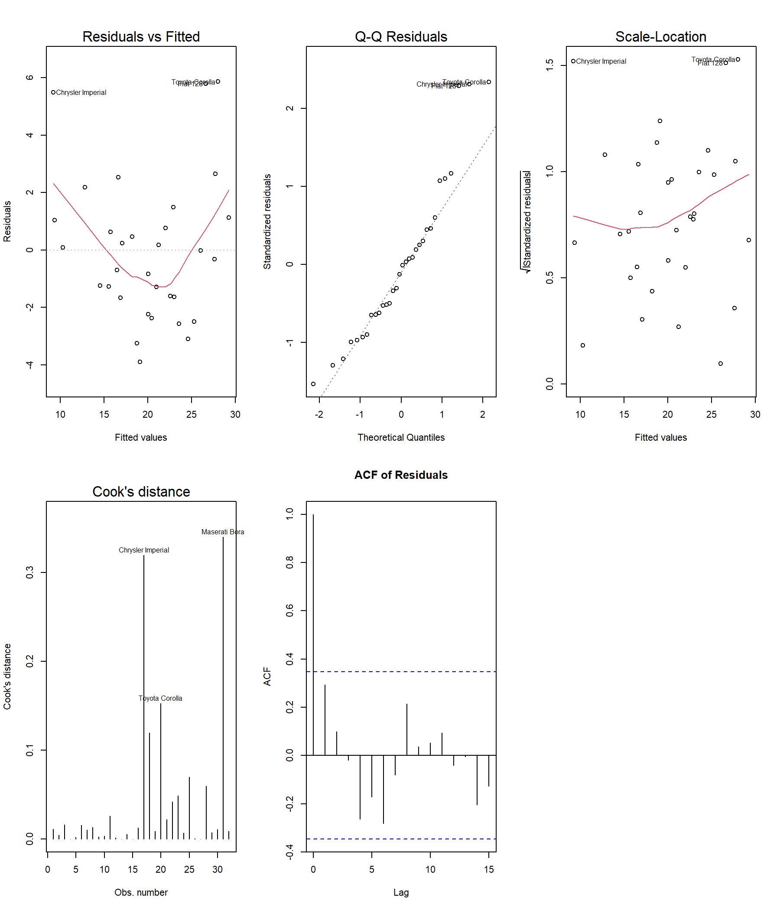
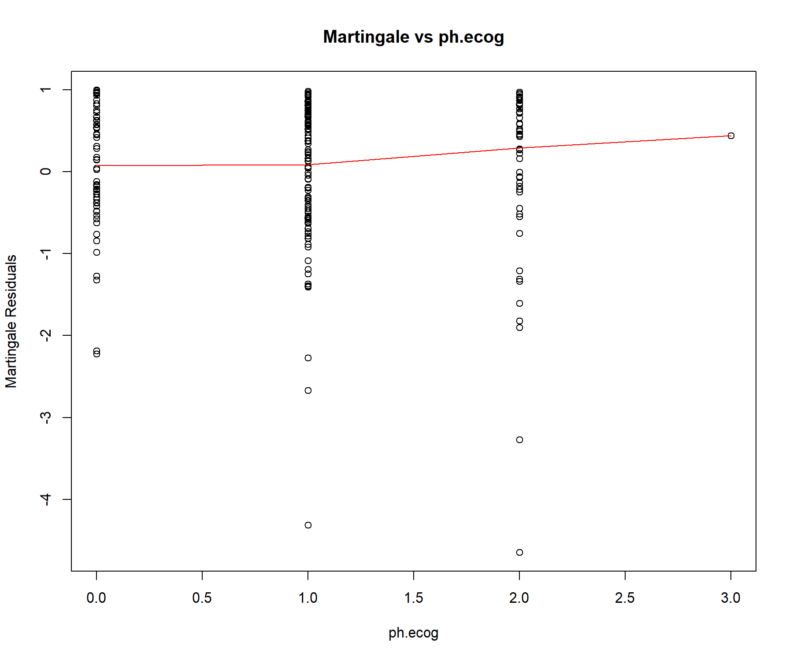

# Summary

Statistical models underpin a broad range of applied research in medicine, ecology,
economics, and the social sciences. Valid inference from these models depends on the
satisfaction of structural assumptions—linearity, homoscedasticity, independence of errors,
correct distributional form, and, in survival analysis, proportional hazards. When assumptions
are violated, coefficient estimates may be biased, standard errors incorrect, and $p$-values
misleading. The `modeldiag` R package [@rcore2024] provides a unified framework for
diagnosing these assumption violations across four widely-used model classes: ordinary linear
models, logistic regression, Poisson regression, and Cox proportional hazards models.

The package exposes a single generic function, `diagnose_model()`, which dispatches—via R's
S3 class system—to the appropriate battery of diagnostic checks for the detected model type.
It returns an object of class `"model_diagnostics"` with `print()`, `summary()`, and `plot()`
methods that deliver structured numerical results, human-readable interpretations, and
publication-quality graphics respectively. Sixteen individual `check_*()` functions are also
exported for targeted, reproducible diagnostic workflows.

# Statement of need

Analysts who work across multiple model families—fitting linear models for continuous
outcomes, logistic regression for binary outcomes, Poisson regression for counts, and Cox
models for time-to-event data—must currently assemble bespoke diagnostic workflows from
disparate packages. Relevant tests are spread across `car` [@fox2019], `lmtest`
[@zeileis2002], `ResourceSelection` [@lele2019], and `survival` [@therneau2000], each with
its own argument conventions and output format. This fragmentation creates friction in
reproducible analysis pipelines and demands that practitioners remember class-specific APIs.

`modeldiag` addresses this by offering a single, consistent interface that automatically
selects and executes the right set of diagnostics for the fitted model class. The package
targets practicing statisticians, epidemiologists, biostatisticians, and data scientists who
need to validate model assumptions efficiently within a reproducible workflow.

# State of the field

Several R packages address portions of the model-diagnostics problem. The `performance`
package [@ludecke2021] provides a `check_model()` function with visual output for linear,
generalised linear, and mixed-effects models, but does not support Cox proportional hazards
models or offer the full suite of GLM-specific diagnostics such as the Hosmer–Lemeshow
goodness-of-fit test or zero-inflation detection. The `DHARMa` package [@hartig2022]
provides simulation-based quantile residuals for GLMs and mixed models; these residuals are
powerful but require additional expertise to interpret and do not extend to Cox models. The
`car` package [@fox2019] provides generalised VIF computation and component-plus-residual
plots but is not designed as a stand-alone, model-class-aware diagnostic workflow.

`modeldiag` was built rather than contributing to existing packages for the following
reasons. First, no existing package provides a single `diagnose_model()` entry point that
covers all four model classes (`lm`, `glm` with binomial and Poisson families, and `coxph`)
with a fully consistent interface. Second, `modeldiag` couples test execution with structured
text interpretation in its `summary()` method, making diagnostic output accessible to
analysts who may not be familiar with the numerical output of individual test functions.
Third, the package exposes both the high-level wrapper and the underlying `check_*()`
functions, supporting both rapid exploratory diagnostics and granular, reproducible pipelines.

# Software design

`modeldiag` implements an S3 dispatch system around a single generic, `diagnose_model()`,
which branches to `diagnose_model.lm()`, `diagnose_model.glm()`, and
`diagnose_model.coxph()` based on the class attribute of the fitted model. Each method
executes the appropriate `check_*()` functions and returns a named list of class
`"model_diagnostics"` containing the model type, the original model object, and all
diagnostic results. The `print()`, `summary()`, and `plot()` S3 methods dispatch on this
class to deliver formatted output and graphics.

The sixteen exported `check_*()` functions can also be called independently, enabling
targeted diagnostics. For each model class the dispatched checks are:

- **Linear models (`lm`):** `check_vif()`, `check_heteroskedasticity()`,
  `check_autocorrelation()`, `check_linearity()`, `check_normality()`, `check_outliers()`
- **Logistic regression (`glm`, `binomial`):** `check_vif()`, `check_box_tidwell()`,
  `check_hosmer_lemeshow()`, `check_influential_glm()`, `check_separation()`
- **Poisson regression (`glm`, `poisson`):** `check_vif()`, `check_overdispersion()`,
  `check_zero_inflation()`, `check_influential_glm()`, `check_residual_analysis()`
- **Cox PH models (`coxph`):** `check_vif()`, `check_proportional_hazards()`,
  `check_influential_coxph()`, `check_functional_form_coxph()`

The package imports `car` [@fox2019], `lmtest` [@zeileis2002], `ResourceSelection`
[@lele2019], and `survival` [@therneau2000] for the underlying test computations, and
depends on base R `stats` and `graphics` for all other operations.

# Mathematics

## Linear Models

The ordinary linear regression model is

$$Y = X\beta + \varepsilon, \quad \varepsilon \sim \mathcal{N}(\mathbf{0},\, \sigma^2 I),$$

where $Y \in \mathbb{R}^n$, $X \in \mathbb{R}^{n \times p}$, and $\beta \in \mathbb{R}^p$.

**Multicollinearity.** When predictors are nearly linearly dependent, the OLS estimator
$\hat{\beta} = (X^\top X)^{-1} X^\top Y$ has inflated variance. The Variance Inflation
Factor for predictor $X_j$ [@fox1992] is

$$\mathrm{VIF}_j = \frac{1}{1 - R_j^2},$$

where $R_j^2$ is the coefficient of determination from regressing $X_j$ on all other
predictors. `modeldiag` classifies severity as negligible ($< 2$), moderate ($2$--$5$),
high ($5$--$10$), or severe ($\geq 10$).

**Heteroscedasticity.** Homoscedasticity requires $\mathrm{Var}(\varepsilon_i) = \sigma^2$.
The Breusch–Pagan test [@breusch1979] regresses squared residuals on the original predictors;
the test statistic is asymptotically $\chi^2$ under $H_0\colon \mathrm{Var}(\varepsilon_i) = \sigma^2$.

**Autocorrelation.** Independence of errors requires $\mathrm{Cov}(\varepsilon_i,
\varepsilon_j) = 0$ for $i \neq j$. The Durbin–Watson statistic [@durbin1950; @durbin1951] is

$$DW = \frac{\sum_{i=2}^{n}(\hat{\varepsilon}_i - \hat{\varepsilon}_{i-1})^2}{\sum_{i=1}^{n}\hat{\varepsilon}_i^2},$$

with values near 2 indicating no autocorrelation.

**Linearity.** The Ramsey RESET test [@ramsey1969] augments the model with powers of the
fitted values $\hat{Y}^2, \hat{Y}^3, \ldots$ and tests their joint significance. Rejection
indicates that $\mathbb{E}[Y \mid X]$ may not be correctly specified as linear in $X$.

**Normality of errors.** The Shapiro–Wilk test [@shapiro1965] evaluates
$\varepsilon \sim \mathcal{N}(0, \sigma^2)$ via

$$W = \frac{\left(\sum_{i=1}^{n} a_i\,\hat{\varepsilon}_{(i)}\right)^2}{\sum_{i=1}^{n}(\hat{\varepsilon}_i - \bar{\varepsilon})^2},$$

where $\hat{\varepsilon}_{(i)}$ are order statistics and $\mathbf{a}$ derives from the
expected values of normal order statistics.

**Influential observations.** Cook's distance [@cook1977; @cook1982] measures the aggregate
shift in $\hat{\beta}$ upon deletion of observation $i$:

\begin{equation}\label{eq:cook}
D_i = \frac{\left(\hat{\beta} - \hat{\beta}_{(i)}\right)^\top X^\top X \left(\hat{\beta} - \hat{\beta}_{(i)}\right)}{p\,\hat{\sigma}^2}.
\end{equation}

Observations with $D_i > 4/n$ (see \autoref{eq:cook}) are flagged as potentially influential.

## Logistic Regression

Logistic regression models a binary outcome through

$$\mathrm{logit}\!\left(P(Y=1 \mid X)\right) = \log\!\left(\frac{p}{1-p}\right) = X\beta.$$

**Linearity of the logit.** The Box–Tidwell test [@box1962] augments the model with
interaction terms $X_j \ln(X_j)$ and tests whether their coefficients are zero, evaluating
whether each continuous predictor enters the log-odds linearly.

**Goodness of fit.** The Hosmer–Lemeshow test [@hosmer2013] partitions observations into
$g = \min(10,\, \lfloor n/5 \rfloor)$ groups based on estimated probabilities and computes

$$\hat{C} = \sum_{k=1}^{g} \frac{(O_k - E_k)^2}{E_k(1 - E_k/n_k)},$$

where $O_k$ and $E_k$ are observed and expected event counts in group $k$. Under good fit,
$\hat{C} \sim \chi^2_{g-2}$.

**Separation.** Complete or quasi-complete separation occurs when a linear combination of
predictors perfectly classifies the outcome, causing maximum-likelihood estimates to diverge.
`modeldiag` detects this by inspecting coefficient values and model convergence status.

## Poisson Regression

Poisson regression assumes $Y \mid X \sim \mathrm{Poisson}(\lambda)$ with
$\log(\lambda) = X\beta$ and the equidispersion property
$\mathrm{Var}(Y) = \mathbb{E}(Y) = \lambda$.

**Overdispersion.** When $\mathrm{Var}(Y) > \mathbb{E}(Y)$, standard errors are
underestimated. The ratio [@dean1989; @cameron2013]

$$\phi = \frac{D_{\text{resid}}}{\mathrm{df}_{\text{resid}}}$$

provides a practical diagnostic; `modeldiag` flags $\phi > 1.5$ as evidence of overdispersion.

**Zero inflation.** When the observed proportion of zeros substantially exceeds the Poisson
expectation,

$$\hat{p}_0^{\,\text{obs}} > 1.5\;\hat{p}_0^{\,\text{exp}}, \quad
\hat{p}_0^{\,\text{exp}} = \frac{1}{n}\sum_{i=1}^{n} e^{-\hat{\lambda}_i},$$

`modeldiag` flags a potential zero-inflated process, prompting consideration of ZIP or ZINB
models.

## Cox Proportional Hazards Model

The Cox model [@cox1972] specifies the hazard as

$$h(t \mid X_i) = h_0(t)\,\exp(X_i\beta),$$

where $h_0(t)$ is an unspecified baseline hazard and $\exp(\beta_j)$ is the hazard ratio
for a one-unit increase in $X_j$.

**Proportional hazards.** The model assumes the hazard ratio is constant over time.
Schoenfeld residuals [@schoenfeld1982] are uncorrelated with time under $H_0$; the
@grambsch1994 test formally evaluates

$$H_0\colon \frac{\partial \beta(t)}{\partial t} = 0$$

via a weighted correlation between scaled Schoenfeld residuals and a monotone function of
time, implemented through `survival::cox.zph()`.

**Influential observations.** Dfbeta residuals approximate the change in $\hat{\beta}_j$
upon deletion of observation $i$. Observations with $|\mathrm{dfbeta}_{ij}| > 0.2$ for any
coefficient are flagged as influential.

**Functional form.** Martingale residuals—the difference between the observed event
indicator and the expected cumulative hazard—are plotted against continuous predictors to
detect non-linear relationships not captured by $X\beta$.

# Usage

## Linear Models

The full diagnostic suite for a linear model is obtained with a single call to
`diagnose_model()`. The `summary()` method prints each result alongside a plain-language
interpretation.

```r
library(modeldiag)

model_lm <- lm(mpg ~ wt + hp + disp, data = mtcars)
diag_lm  <- diagnose_model(model_lm)
summary(diag_lm)
```

Individual checks are also available for targeted analysis:

```r
check_vif(model_lm)
check_heteroskedasticity(model_lm)
check_autocorrelation(model_lm)
check_linearity(model_lm)
check_normality(model_lm)
check_outliers(model_lm)
```

The `plot()` method renders a grid of diagnostic panels including residuals versus fitted
values, a normal Q-Q plot, scale-location, residuals versus leverage, and the
autocorrelation function of residuals (\autoref{fig:lm-plot}).

```r
plot(diag_lm)
```

{ width=90% }

## Logistic Regression

```r
model_glm <- glm(am ~ wt + hp, data = mtcars, family = binomial)
diag_glm  <- diagnose_model(model_glm)
summary(diag_glm)
```

Individual logistic regression diagnostics:

```r
check_vif(model_glm)
check_box_tidwell(model_glm)
check_hosmer_lemeshow(model_glm)
check_influential_glm(model_glm)
check_separation(model_glm)
```

## Poisson Regression

```r
model_pois <- glm(carb ~ wt + hp, data = mtcars, family = poisson)
diag_pois  <- diagnose_model(model_pois)
summary(diag_pois)
```

Individual Poisson diagnostics:

```r
check_vif(model_pois)
check_overdispersion(model_pois)
check_zero_inflation(model_pois)
check_residual_analysis(model_pois)
```

## Cox Proportional Hazards Model

```r
library(survival)
data(lung)

model_cox <- coxph(Surv(time, status) ~ age + sex + ph.ecog, data = lung)
diag_cox  <- diagnose_model(model_cox)
summary(diag_cox)
```

Individual Cox model diagnostics:

```r
check_proportional_hazards(model_cox)
check_influential_coxph(model_cox)
check_functional_form_coxph(model_cox)
```

Diagnostic plots for the Cox model (\autoref{fig:cox-plot}) display Schoenfeld residual
trends over time, dfbeta influence plots for each coefficient, and martingale residuals
against continuous predictors.

```r
plot(diag_cox)
```

{ width=90% }

# AI usage disclosure

No generative AI tools were used in the development of this software or the writing of
this manuscript.

# Acknowledgements

The authors acknowledge the developers of `car` [@fox2019], `lmtest` [@zeileis2002],
`ResourceSelection` [@lele2019], and `survival` [@therneau2000], whose implementations
provide the foundational test computations on which `modeldiag` builds.

# References
